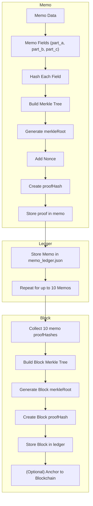

# 🔐 Proofs in CoT Ledger

Every entry in the CoT Ledger (memo, decision, audit, etc.) is made verifiable using lightweight, scalable cryptographic proofs — without the computational overhead of zero-knowledge systems.

This document outlines how Merkle proofs, proof hashes, and deterministic hashes are used to ensure integrity, traceability, and blockchain compatibility.

---

## 🧾 Proof Structure

Each memo produces:
- A leaf-level proof hash
- A Merkle root from all memo components
- A nonce for uniqueness
- A proofID (optional human-readable or agent-readable ref)

---

### ✅ Memo-Level Proof Example

```json
"proof": {
  "merkleRoot": "1d96c20b6f6da431c50ed2a4cfb1447f4097bd7ea6f956722def2228a2920616",
  "nonce": "ae87eb9ddc8748ea33202c76",
  "proofHash": "b8bc887e65d36546563c9fb3a1e65ef9982dd066d7a3208d25f59ce48e10426f",
  "proofID": "Proof_GENESIS_a65b48"
}
```
## 🧾 Proof Anatomy

### merkleRoot
> Root hash generated from all memo fields

### proofHash
> Hash of `merkleRoot + nonce`, used for external anchoring and integrity checks

### nonce
> Randomized value to ensure each proof is unique, even with identical inputs

### proofID
> Optional tag for tracking the proof's type, origin, or associated AI agent

---

## 📦 Block-Level Proof Example

When `block_size` is met (e.g. 10 memos), a **block** is formed.  
Its `proof` structure includes:

- All memo `proofHash` values  
- NFT or agent identifiers  
- Final `block_id`  
- Aggregate `merkleRoot`  
- Final `proofHash` for blockchain anchoring

```json
"proof": {
  "leaves": {
    "memo_1_proofHash": "...",
    "memo_2_proofHash": "...",
    "memo_3_proofHash": "...",
    "...": "...",
    "block_id": "f7cf0423f116a29c18407b0bf13bc61f85f45076e65ceb7577dfd444826c3db0"
  },
  "merkleRoot": "52ee18ac8824dc48e4ac130ae4853e99edbfc2a63029cce390fdf1a1208bfda2",
  "nonce": "855e9edeb6ccabddbe641dd7",
  "proofHash": "60eeeb02a4175e87519f619464c7df53827ed319d8c53ccb13624ef0ac9b6e74",
  "proofID": "Proof_GENESIS_4a1fc9"
}
```
## 🧠 What Gets Hashed?

Each memo generates its own proof using a deterministic set of fields:

- `ledger_id`, `memo_id`, `network`, `transaction_type`
- `agent_id`, `model_used`, `confidence_score`, etc.
- Every field in `part_a`, `part_b`, and `part_c`
- `meta_data`, `nft_id`, `timestamp`

These are hashed individually, then **structured into a Merkle Tree** to compute the final `merkleRoot`.

---

## 🌲 Why Use Merkle Proofs?

- ✅ Lightweight – Suitable for mobile, edge devices, and smart contracts
- ✅ Scalable – Handles thousands of memos efficiently
- ✅ ZK-Level Integrity – Verifiability without the cost of full zk-SNARKs/STARKs
- ✅ Off-chain / On-chain Compatible – Store locally, in IPFS, or anchor to public chains

---

## 🔗 Blockchain Anchoring

CoT Ledger proof hashes can be optionally written to:

- Ethereum – as event logs or calldata
- Solana – via transaction memo fields or account metadata
- XRP Ledger – using Hooks or native memo fields
- Base / OP Chains / Filecoin / Arweave – for decentralized, low-cost anchoring

🪙 CoT Ledger also supports NFT minting to represent memo ownership or audit attestations.

---

## 🧪 Proof Verification

You can validate any memo or block without access to private AI data:

- ✅ Recalculate the Merkle root to verify memo integrity
- ✅ Compare proofHash to anchored on-chain data
- ✅ Reconstruct a full block proof using stored memo hashes
- ✅ Use `proofID` and `nft_id` for verification across systems or agents

No original reasoning data needs to be exposed — just the hashed structure.

---

## ✅ Summary

| Proof Level | Description                            | Output                              |
|-------------|----------------------------------------|--------------------------------------|
| Memo    | Logs CoT, audit, and metadata           | `merkleRoot`, `proofHash`, `nonce`  |
| Proof   | Contains hashes for all memo elements   | Stored in `proof` object inside memo|
| Block   | Aggregates 10 memos into a block        | `block_id`, `merkleRoot`, full proof ledger |

---

## 🧭 Memo ➝ Proof ➝ Block (Mermaid Diagram)

